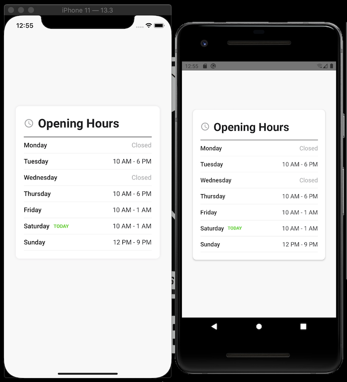

# Opening Hours

## How To Run
You can run the project by these steps:
 1. Clone the project
 2. Open it on your terminal
 3. Run `yarn` or `npm install` to install node dependencies
 4. Go to `ios` folder and run `pod install`
 4. Run `react-native run-ios` or `react-native run-android` from the root directory to run the project.
 5. To run tests, you can run `npm run test`

 ## Note
 I used `elevation` for shadows on Android which is the standard of Material design, but if we want to provide the same shadows for both platform without considering the platforms design patterns, we should use 3rd party libraries.
